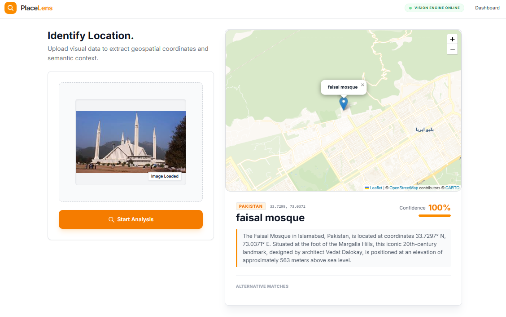
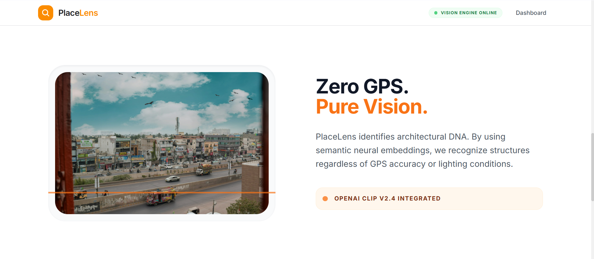

# PlaceLens

PlaceLens is a Django-based landmark search app that uses image embeddings and FAISS similarity search to identify places from uploaded photos. The project includes a landing page, a dashboard for image upload, and a REST endpoint for programmatic search.

## Screenshots






## What It Does

- Loads a CLIP model from `sentence-transformers` for image embeddings.
- Builds a FAISS index from landmark images stored in the database.
- Accepts an uploaded image and returns the closest matching landmark.
- Stores uploaded search history in SQLite.
- Serves a marketing landing page and a dashboard UI.

## Tech Stack

- Django 5.2.6
- Django REST Framework
- sentence-transformers
- FAISS CPU
- Pillow
- NumPy
- SQLite

## Project Structure

- `config/` - Django project settings and URL routing
- `core/` - main app, models, views, AI helpers, and management commands
- `templates/` - shared HTML templates
- `static/` - CSS, JavaScript, and static assets
- `media/` - uploaded images and landmark assets
- `places.index` - FAISS index used for search

## Local Setup

1. Create and activate a virtual environment.
2. Install dependencies:

```bash
pip install -r requirements.txt
```

3. Run migrations:

```bash
python manage.py migrate
```

4. Create a superuser if you want to use the admin:

```bash
python manage.py createsuperuser
```

5. Build the FAISS index after your `Place` records and images are in the database:

```bash
python manage.py build_index
```

6. Start the development server:

```bash
python manage.py runserver
```

Open `http://127.0.0.1:8000/` in your browser.

## Docker

The repository includes a Docker setup with Gunicorn and Nginx.

```bash
docker compose up --build
```

The web app will be available through Nginx on port `80`.

## Routes

- `/` - landing page
- `/placefinder/` - image upload dashboard
- `/api/search/` - landmark search API
- `/admin/` - Django admin

## Search API

The search endpoint expects a multipart form upload with an `image` field.

Example:

```bash
curl -X POST http://127.0.0.1:8000/api/search/ \
  -F "image=@/path/to/photo.jpg"
```

Typical successful response:

```json
{
  "matches": [
    {
      "name": "Faisal Mosque",
      "country": "Pakistan",
      "description": "...",
      "lat": 33.7294,
      "lng": 73.0379,
      "confidence": "0.92",
      "image_url": "http://127.0.0.1:8000/media/places/..."
    }
  ]
}
```

If the confidence score is too low, the API returns an empty `matches` list with a message explaining that no landmark was detected.

## Notes

- The CLIP model is loaded when Django starts in `runserver` mode.
- The FAISS index is expected to live at the project root as `places.index`.
- Media files are stored under `media/`.